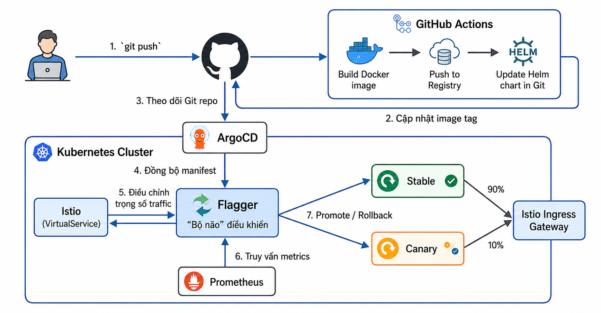

# Canary Deployment on Kubernetes với Istio & Flagger

## Kiến trúc



## Yêu cầu

- Kubernetes cluster (Kind, K3s, GKE, EKS, AKS)
- Istio đã cài đặt
- Flagger đã cài đặt
- ArgoCD đã cài đặt
- Prometheus cho metrics

## Triển khai

### 1. Cài đặt Istio

```bash
# Cài Istio với istioctl
istioctl install --set profile=default -y

# Enable istio injection cho namespace default
kubectl label namespace default istio-injection=enabled
```

### 2. Cài đặt Flagger

```bash
# Cài Flagger với Prometheus metrics
helm repo add flagger https://flagger.app
helm install flagger flagger/flagger \
  --namespace istio-system \
  --set metricsServer=http://prometheus:9090 \
  --set istio.enabled=true
```

### 3. Cài đặt ArgoCD

```bash
kubectl create namespace argocd
kubectl apply -n argocd -f https://raw.githubusercontent.com/argoproj/argo-cd/stable/manifests/install.yaml

# Get ArgoCD password
kubectl -n argocd get secret argocd-initial-admin-secret -o jsonpath="{.data.password}" | base64 -d
```

### 4. Cấu hình ArgoCD Application

```yaml
apiVersion: argoproj.io/v1alpha1
kind: Application
metadata:
  name: canary-app
  namespace: argocd
spec:
  project: default
  source:
    repoURL: https://github.com/<your-repo>/canary-k8s
    targetRevision: main
    path: canary-chart
  destination:
    server: https://kubernetes.default.svc
    namespace: default
  syncPolicy:
    automated:
      prune: true
      selfHeal: true
```

### 5. Triển khai ứng dụng

```bash
# Build và push image đầu tiên (stable)
docker build -t caominhquang1604/canary-app:stable ./app
docker push caominhquang1604/canary-app:stable

# Update values.yaml với stable version
cat > canary-chart/values.yaml << EOF
replicaCount: 2
image:
  repository: caominhquang1604/canary-app
  tag: "stable"
canary:
  enabled: true
EOF

# Commit và push để ArgoCD sync lần đầu
git add . && git commit -m "initial deploy" && git push

# Apply ArgoCD application
kubectl apply -f application.yaml
```

## Quy trình Canary Release

### Khi push code mới:

1. **CI Pipeline**:
   - Build Docker image với tag `canary-<commit-hash>`
   - Push lên Docker Hub
   - Update `values.yaml` với tag canary mới
   - Commit và push

2. **ArgoCD Sync**:
   - ArgoCD phát hiện thay đổi trong values.yaml
   - Sync Helm chart

3. **Flagger Canary**:
   - Tạo canary Deployment với image mới
   - Istio VirtualService chia traffic: 0% → 10% → 20% → ... → 50%
   - Prometheus metrics được thu thập mỗi 1 phút
   - Kiểm tra success rate ≥ 99% và latency ≤ 500ms

4. **Kết quả**:
   - **Promote**: Nếu metrics OK sau 3 lần kiểm tra → traffic 100% sang canary
   - **Rollback**: Nếu metrics fail → canary rollback về 0%, stable vẫn hoạt động

## Giám sát

### Xem trạng thái Canary

```bash
# Xem canary status
kubectl get canary -n default

# Xem chi tiết
kubectl describe canary canary-app -n default
```

### Xem logs

```bash
# Xem Flagger logs
kubectl logs -n istio-system deploy/flagger -f

# Xem canary deployment
kubectl get pods -l app=canary-app -n default
```

### Xem traffic

```bash
# Xem VirtualService
kubectl get virtualservice canary-app -o yaml -n default
```

## Test Canary

```bash
# Test với load
for i in {1..100}; do
  curl -s -o /dev/null -w "%{http_code}\n" http://<ingress-ip>/
done

# Xem phân chia traffic
kubectl get svc canary-app-canary -n default
```

## Cấu trúc thư mục

```
.
├── .github/workflows/ci.yml    # CI Pipeline
├── app/                         # Ứng dụng mẫu
│   ├── Dockerfile
│   ├── nginx.conf
│   └── index.html
├── canary-chart/               # Helm chart
│   ├── Chart.yaml
│   ├── values.yaml
│   └── templates/
│       ├── deployment.yaml     # Main deployment
│       ├── service.yaml        # Kubernetes service
│       ├── gateway.yaml        # Istio Gateway
│       ├── destinationrule.yaml
│       └── canary.yaml         # Flagger Canary CRD
└── README.md
```
